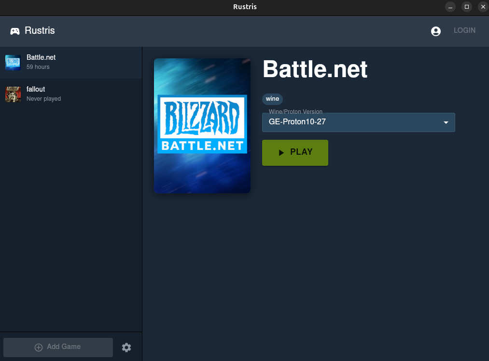
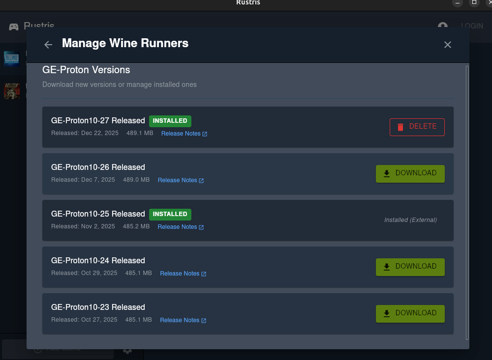
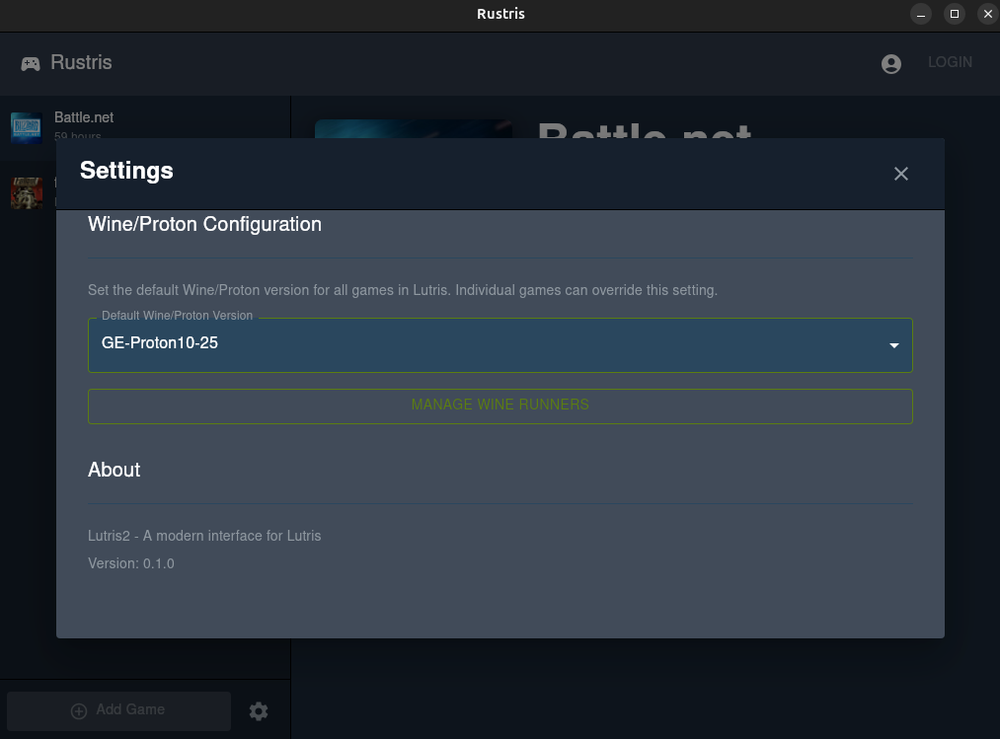

# Rustris

A modern, user-friendly interface for managing Wine/Proton runners in Lutris.

### 🚧 Work In Progress (WIP)
This project is currently under active development. Features may be incomplete, and the codebase is subject to significant changes.

---

## What is Rustris?

Rustris is a companion app for Lutris that makes it easy to manage Wine and Proton versions for your Windows games on Linux. If you've ever struggled with switching Proton versions or keeping up with the latest GE-Proton releases, Rustris simplifies the process with a clean, intuitive interface.

## Requirements

- **Lutris** must be installed on your system
  - Install via your distribution's package manager or from [lutris.net](https://lutris.net)
- A Linux system (tested on Ubuntu/Debian-based distributions)

---

## Features

### 🎮 Easy Runner Management
Switch between different Wine/Proton versions for your games with just a few clicks - no need to dig through config files or use command-line tools.

### 📥 One-Click Proton Installation
Download and install the latest GE-Proton versions directly from the app. Stay up-to-date with the best compatibility layers for your Windows games.

### ⚙️ Global & Per-Game Settings
Set a default Wine/Proton version for all your games, or customize each game individually for optimal performance.

---

## How to Use Rustris

### Main Screen - Managing Your Games

The main screen shows all your Wine/Proton games from Lutris:

1. **Game Library** (left sidebar): Browse your installed games with playtime information
2. **Game Details** (center): View game information and cover art
3. **Wine/Proton Version Dropdown**: Quickly switch the Proton version for the selected game
4. **Play Button**: Launch your game with the selected runner

**To change a game's Proton version:**
1. Select a game from the left sidebar
2. Click the Wine/Proton Version dropdown
3. Choose your preferred version
4. Click PLAY to launch the game

### Proton Manager - Download New Versions

Access the Proton Manager to download or remove Wine/Proton versions:

1. Click the **Settings** icon (gear) at the bottom left of the main screen
2. In the Settings dialog, click **MANAGE WINE RUNNERS**
3. Browse available GE-Proton versions
4. Click **DOWNLOAD** to install a new version
5. Click **DELETE** to remove versions you no longer need

**Installed versions** are marked with a green "INSTALLED" badge. External installations (from outside Rustris) are also detected and labeled.

### Global Settings - Set Default Proton Version

Set a default Wine/Proton version that applies to all games in Lutris:

1. Click the **Settings** icon (gear) at the bottom left
2. Under "Wine/Proton Configuration", select your preferred default version
3. Individual games can still override this setting if needed

This is useful when you want most of your games to use the same proven Proton version, like the latest GE-Proton release.

---

## Tips for Best Results

- **Start with the latest GE-Proton**: GE-Proton (Glorious Eggroll) often has better game compatibility than stock Proton
- **Experiment with versions**: If a game doesn't work well, try switching to a different Proton version
- **Keep 2-3 versions installed**: Having multiple versions available helps with compatibility testing
- **Check release notes**: Click the "Release Notes" links in the Proton Manager to see what's new in each version

---

## License & Usage

Copyright (c) 2025 **Alejandrade**

This project is licensed under the **Creative Commons Attribution-NonCommercial-ShareAlike 4.0 International (CC BY-NC-SA 4.0)** license.

### 🚫 Non-Commercial Only
You are free to view, copy, and modify this code for personal or educational use. however:
* **No Commercial Use:** You may **not** use this project or any part of it for commercial purposes, profit, or private monetary compensation.
* **Share-Alike:** Any derivative works must be shared under this same license.
* **Attribution:** You must give appropriate credit to **Alejandrade**.

For more details, please see the [LICENSE.md](./LICENSE.md) file.